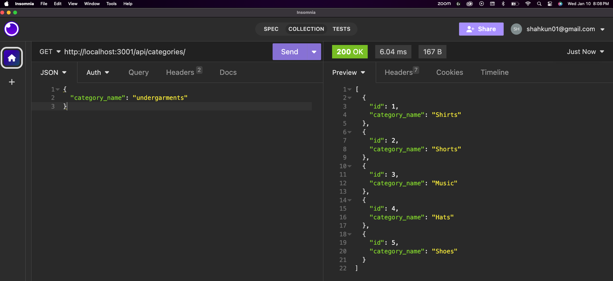

  ## Ecommerce Backend app (module 13)
    
  ## Description
  This is a backend application for an ecommerce store which uses sequelize, express, mysql2 and dotenv. 

  ## Installation
  Installation instructions:
  1) clone the repository (https://github.com/unfazedxx/Employee_Tracker_SQL.git)
  2) Install the required dependencies using (npm i)
  2) Open the MySQL CLI by typing (mysql -u root -p)
  3) enter your password
  4) source the schema and seed data using (source ./db/schema.sql)
  5) Type (quit) to get out of sql
  6) Type (npm run seed) to seed the program    
  7) Type (npm start) to invoke the program
  8) Go to Insomnia to view the application based on put, post, delete, and get requirements. 

  ## Usage
  SEE INSTRUCTIONS ABOVE 

  ## Licenses
  None  
  ## Contributing 
  there is no contributing to this project, but thank you anyway
    
  ## Tests
  no tests
    
  ## Questions 
  Please reach out if there are any additional questions: shahkun01@gmail.com
  Find more projects located on my github page: https://github.com/unfazedxx       
  

 